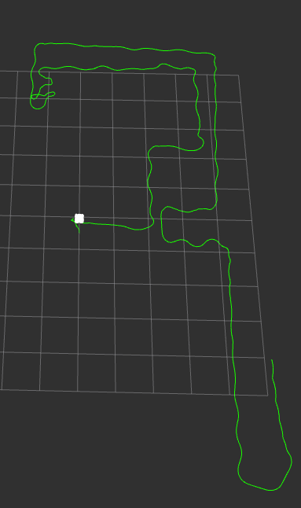
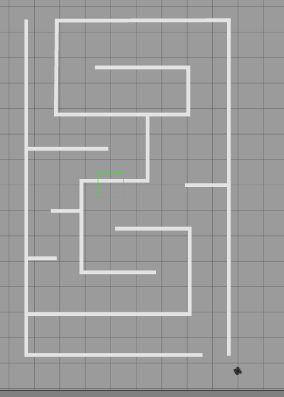

# Wall-Following Mobile Robot with PID Controller

## Overview

This project involves the development of a wall-following mobile robot using a PID (Proportional-Integral-Derivative) controller. The robot is simulated in the ROS (Robot Operating System) environment, utilizing Gazebo and RViz simulators for a comprehensive and realistic simulation.

## Project Description

In this project, we have created a mobile robot capable of autonomously following walls while maintaining a fixed distance from them. Key components of the project include:

- **PID Controller**: We have implemented a PID controller that fine-tunes the robot's movements based on sensor input to ensure it stays at the desired distance from the wall.

- **Simulation Environment**: The simulation takes place within the ROS ecosystem, utilizing Gazebo for the physical simulation of the robot and RViz for visualization.

- **Sensor Integration**: The robot is equipped with suitable sensors, such as proximity sensors or LiDAR, to detect and measure distances from nearby walls.

- **Autonomous Wall Following**: The robot navigates autonomously, following the contours of the walls in the environment while avoiding collisions.

## Project in Action

*Above: A visual representation of the wall-following robot path in action within the RVIZ environment.*

## Project Workflow

1. **Sensor Data Acquisition**: The robot collects data from its sensors, such as distance measurements to nearby walls.

2. **PID Control**: The PID controller processes sensor data to calculate steering commands, adjusting the robot's motion to maintain the desired distance from the wall.

3. **Simulated Environment**: The robot's behavior and movements are simulated in Gazebo, and the results are visualized in RViz.

4. **Wall Following**: The robot autonomously follows walls, adjusting its trajectory as needed to keep the specified distance.

## Use Cases

- **Educational Robotics**: This project serves as an educational tool for teaching PID control and autonomous navigation principles in robotics.

- **Robotics Research**: Researchers can use this project as a foundation for experimenting with and enhancing wall-following algorithms.

- **Autonomous Vehicles**: Wall-following algorithms have applications in the field of autonomous vehicles, such as parking assistance systems.

## Getting Started

To get started with this project, you'll need:

- A robot model configured for ROS/Gazebo simulations.
- Knowledge of ROS, Gazebo, and PID controllers.
- Access to wall-following algorithms and related resources.

## License

This project is open-source and available under the [MIT License](LICENSE.md). You are free to use, modify, and distribute it according to the terms of the license.
